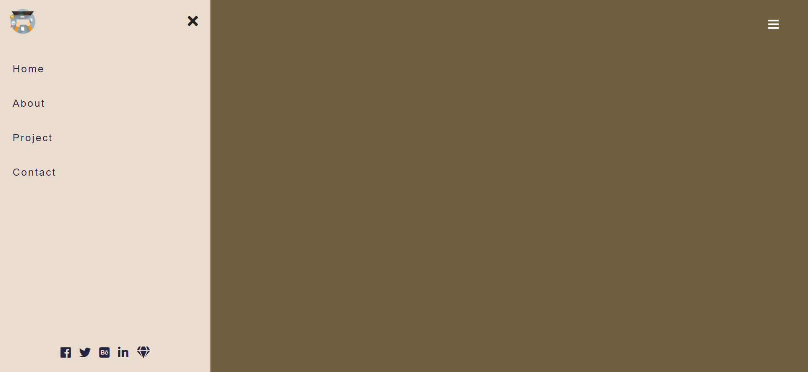

# Responsive Sidebar

To start project

1. Download or clone git repository
2. Install any Live Server
3. Right button click to launch live server

---

Completed project available [here](https://malinsp.github.io/sidebar.github.io/)

---

#### Screenshots

